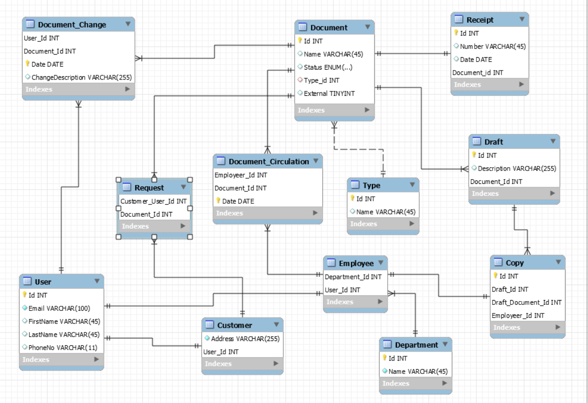

# Building a MicroService

This repo is for the microservice task where the task deliverables are as follow:

- [x] Entity Relationship Diagram.
- [x] SQL Script.
- [x] API endpoints for dealing with customers.


### 1. Entity Relationship Diagram modeling the Database described in the requirements. 

You can open the ERD in MySQL Workbench by importing `ERD_Model.mwb` file.




### 2. SQL Script for the ERD.

You can find the required sql script to generate the above ERD in the `DatabaseCreation.sql` file.
> Notice that you can run the script against your local connection to a MySQL Database and see the tables created.


### 3. API endpoints for CRUD operations with 'Customer'.

The repo consists of 3 main python files:
- `app.py` for the **Flask** application and its routes (endpoints)
- `businesslogic.py` contains basic business logic as well as validation
- `db.py` for interacting with the database with **SQL** queries 

In order to test the application:
1. Clone the repo
    ```
    git clone https://github.com/marwanatef2/MicroServiceTask.git
    cd MicroServiceTask
    ```
2. Create a virtual environment and activate it
    ```
    python -m venv venv
    venv/Scripts/activate
    ```
3. Install the dependencies
    ```
    pip install -r requirements.txt
    ```
4. Add the `.env` file for the database connection string with the following keys:
    ```
    DB_SERVER='localhost'
    DB_USER='youruser'
    DB_PASSWORD='yourpassword'
    DB_DATABASE='mydb'
    ```
5. Run the application
    ```
    flask run
    ```
6. Open Postman and try different endpoints
    - Set the url to `http://localhost:5000/api/customer/add`
    - Choose **POST** as the REST verb of the request
    - Set the request body to a json object as follows
      ```
      {
        "email": "a@b.c",
        "firstName": "Marwan",
        "lastName": "Atef",
        "phoneNo": "01234567897"
        "address": "your favorite travelling place"
      }
      ```
    - Now *send* the request and you should get a **JSON** response indicating that the customer was added successfully.
7. Now try getting the added record
   - Set the url to `http://localhost:5000/api/customer/`
   - Choose **GET** as the REST verb 
   - Send the request and you should get a list of all added records
